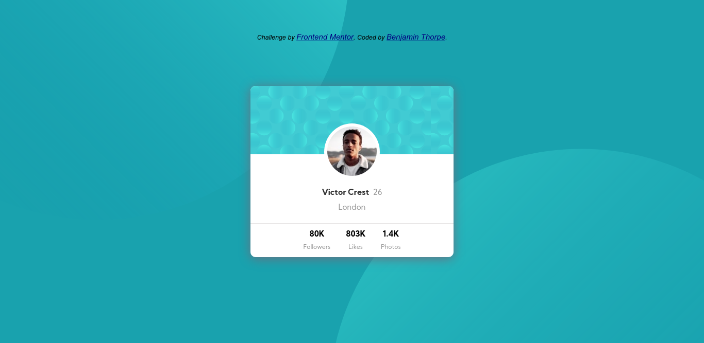

# Frontend Mentor - Profile card component solution

This is a solution to the [Profile card component challenge on Frontend Mentor](https://www.frontendmentor.io/challenges/profile-card-component-cfArpWshJ). Frontend Mentor challenges help you improve your coding skills by building realistic projects.

## Table of contents

- [Overview](#overview)
  - [The challenge](#the-challenge)
  - [Screenshot](#screenshot)
  - [Links](#links)
- [My process](#my-process)
  - [Built with](#built-with)
  - [What I learned](#what-i-learned)
- [Author](#author)


## Overview

### The challenge

- Build out the project to the designs provided

### Screenshot



### Links

- Solution URL: [Source Code](https://github.com/benjithorpe/profile-card-component)
- Live Site URL: [Live Site (Demo)](https://profile-card-com.netlify.app/)


## My process

### Built with

- Semantic HTML5 markup
- CSS custom properties
- Flexbox
- Mobile-first workflow


### What I learned

Went over CSS `position` & `z-index` properties again and I have learnt a lot more about using them.

```css
.top-circle img{
  position: absolute;
  top: -65em;
  left: -69em;
}

.bottom-circle img{
  position: absolute;
  right: -67em;
  bottom: -62.5em;
}
```

## Author

- Website - [Benjamin Thorpe](https://benjithorpe.github.io/)
- Frontend Mentor - [@benjithorpe](https://www.frontendmentor.io/profile/benjithorpe)
- Twitter - [@benjithorpe1](https://www.twitter.com/benjithorpe1)
